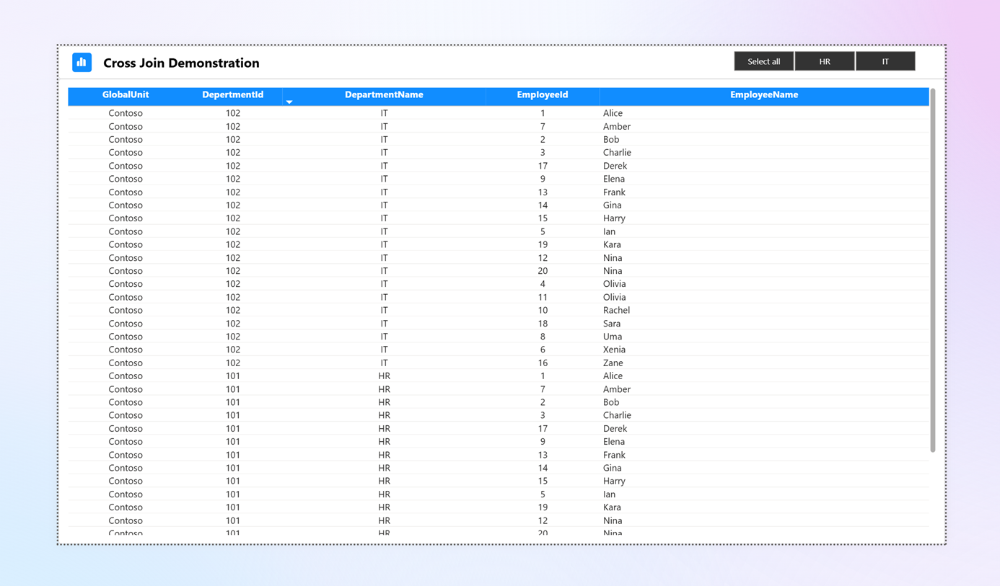

# Power BI Demonstration for Cross Join ✨

## Overview 📖

This repository demonstrates how to perform a cross join in Power BI using sample employee and department datasets.

### Contents 📂

- 📄 **emp.csv**: 20 sample employees with unique IDs and names.
- 📄 **dept.csv**: 2 departments (HR and IT) with unique IDs.
- 📊 **Power BI Report**: Demonstrates cross join between employees and departments.

    
